# SpringMVC

## 简介

### 什么是 MVC

 一种软件架构思想，将软件按照 **模型，视图，控制器** 来划分

M：Model，模型层，指的是工程中的 JavaBean，用来处理/存储数据，一般分为两种

1. 实体类 Bean：专门用来存储业务数据，如 Student，User 等
2. 业务处理类 Bean：指 Service / Dao 对象，专门用于处理业务逻辑和数据访问

V：View，视图层，指工程种的 html / jsp 等页面，作用是与用户进行交互，展示数据

C：Controller，控制层，指工程种的 servlet ，作用是接收和响应请求

> MVC 工作流程

用户通过 View(视图层) 发送请求到服务器，在服务器种请求被 Controller(控制层) 接收，Controller 调用相应的 Model 层处理请求，处理完毕后将结果返回给 Controller，Controller 再根据请求处理结果找到相应的 View 视图，渲染数据后最终响应给服务器

### 什么是 SpringMVC

SpringMVC 是 Spring 的一个后续产品，是 Spring 的一个子项目

SpringMVC 是 Spring 为**表述层**提供的一整套完备的解决方案，是目前业界的主流

> 注：三层架构分为表述层，业务逻辑层，数据访问层；其中表述层表示前台页面和后台 servlet

### SpringMVC 的特点

- Spring 家族原生产品，与 IOC 容器等基础设施无缝对接
- 基于**原生的 servlet**，通过功能强大的**前端控制器 DispatcherServlet**，对请求和响应进行统一处理
- 社区生态活跃度高，对于各细分领域需要解决的问题全方位覆盖，提供全面解决方案
- 代码清新简洁，大幅度提高开发效率
- 内部组件化程度高，可插拔式即插即用，想要什么功能配置添加相应组件即可
- **性能卓越**，适合现代大型，超大型互联网项目要求

## HelloWorld

### 创建 Maven 项目

1. 新建项目

   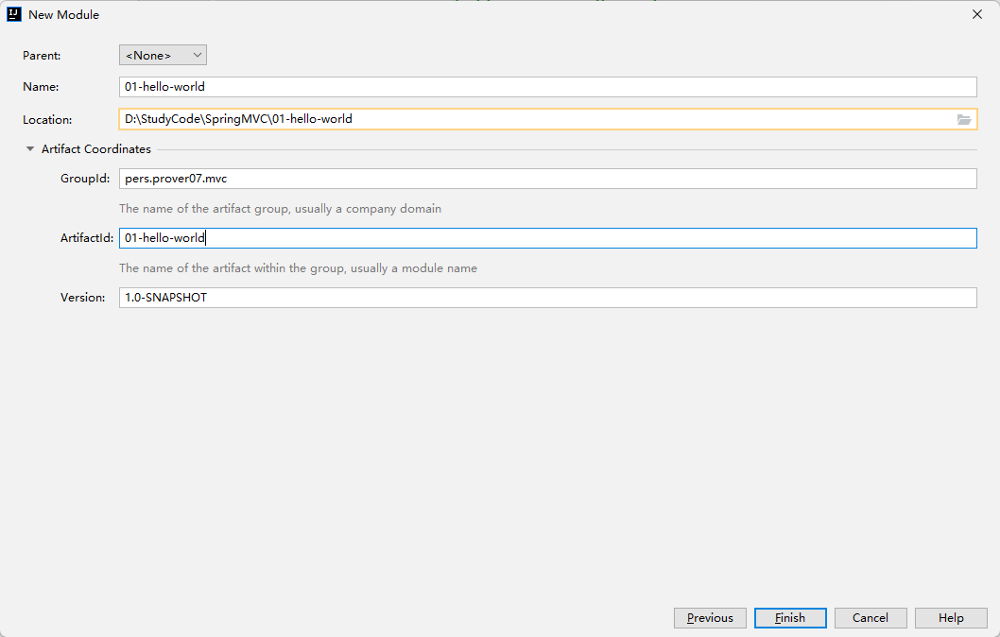

2. 导入依赖

   ```xml
   <!-- 修改打包方式 -->
   <packaging>war</packaging>
   
   <dependencies>
       <!-- SpringMVC -->
       <dependency>
           <groupId>org.springframework</groupId>
           <artifactId>spring-webmvc</artifactId>
           <version>5.3.14</version>
       </dependency>
   
       <!-- 日志 -->
       <dependency>
           <groupId>ch.qos.logback</groupId>
           <artifactId>logback-classic</artifactId>
           <version>1.2.10</version>
       </dependency>
   
       <!-- Servlet API -->
       <dependency>
           <groupId>javax.servlet</groupId>
           <artifactId>javax.servlet-api</artifactId>
           <version>3.1.0</version>
           <!-- provided：该依赖已被服务器提供给，不会参与打包 -->
           <scope>provided</scope>
       </dependency>
   
       <!-- Spring5 整合 Thymeleaf -->
       <dependency>
           <groupId>org.thymeleaf</groupId>
           <artifactId>thymeleaf-spring5</artifactId>
           <version>3.0.14.RELEASE</version>
       </dependency>
   </dependencies>
   ```

3. 在 `src/main`文件夹下创建 `webapps`目录，然后创建 `web.xml`文件

   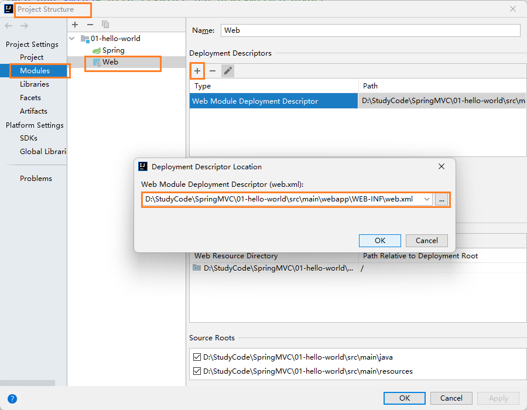

### 配置 web.xml

> 通过 `web.xml` 配置核心控制器 DispatcherServlet 激活 SpringMVC

#### 默认配置方式

如果采用该配置方式，就需要在 `webapp` 下创建注册 DispatcherServlet 时使用的 `<servlet-name>` 加上 `-servlet.xml` 文件

```xml


<servlet>
    <servlet-name>SpringMVC</servlet-name>
    <servlet-class>org.springframework.web.servlet.DispatcherServlet</servlet-class>
</servlet>

<servlet-mapping>
    <servlet-name>SpringMVC</servlet-name>
    <!--
    	/: 表示拦截除了 *.jsp 外的所有请求
        /*: 表示拦截所有请求
    -->
    <url-pattern>/</url-pattern>
</servlet-mapping>

```

以上述为例，就需要在 `webapp`下创建 **SpringMVC-servlet.xml** 作为 SpringMVC 的配置文件

#### 扩展配置方式

通过 `<init-param>`指定 SpringMVC 配置文件的位置和名称

```xml
<init-param>
    <param-name>contextConfigLocation</param-name>
    <!-- 指定在 main/resources 目录下 -->
    <param-value>classpath:spring-mvc.xml</param-value>
</init-param>

<!-- 将 Dispatcher 初始化时间修改到服务器启动时 -->
<load-on-startup>1</load-on-startup>
```

在 `main/resources`创建对应的配置文件即可

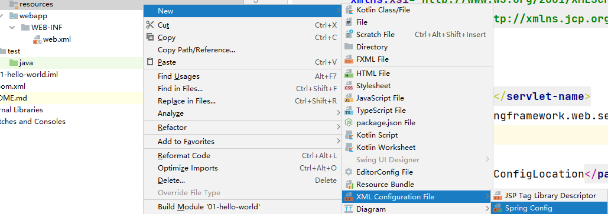


### 访问首页

1. 创建控制器组件

   ```java
   @Controller
   public class HelloController {
   
       @RequestMapping("/")
       public String index(){
           return "index";
       }
   
   }
   ```

2. 在 `spring-mvc.xml`中配置组件扫描和 Thymeleaf 视图解析器

   ```xml
   <!-- 配置组件扫描 -->
   <context:component-scan base-package="pers.prover07.mvc"/>
   
   <!-- 配置视图解析器 -->
   <bean id="viewResolver"
   class="org.thymeleaf.spring5.view.ThymeleafViewResolver">
       <property name="order" value="1" />
       <property name="characterEncoding" value="UTF-8" />
       <property name="templateEngine">
           <bean class="org.thymeleaf.spring5.SpringTemplateEngine">
               <property name="templateResolver">
                   <bean class="org.thymeleaf.spring5.templateresolver.SpringResourceTemplateResolver">
                       <!-- 视图前缀 -->
                       <property name="prefix" value="/WEB-INF/templates/" />
                       <!-- 视图后缀 -->
                       <property name="suffix" value=".html" />
                       <property name="templateMode" value="HTML5" />
                       <property name="characterEncoding" value="UTF-8" />
                   </bean>
               </property>
           </bean>
       </property>
   </bean>
   ```

3. 在 `/WEB-INF/templates/` 下创建 `index.html`文件

   注意：文件名应该为控制器中请求方法返回的字符串(也成为视图名)，该视图名最后会经过视图解析器得到 `/WEB-INF/templates/视图名.html`

4. 配置 Tomcat 进行启动

   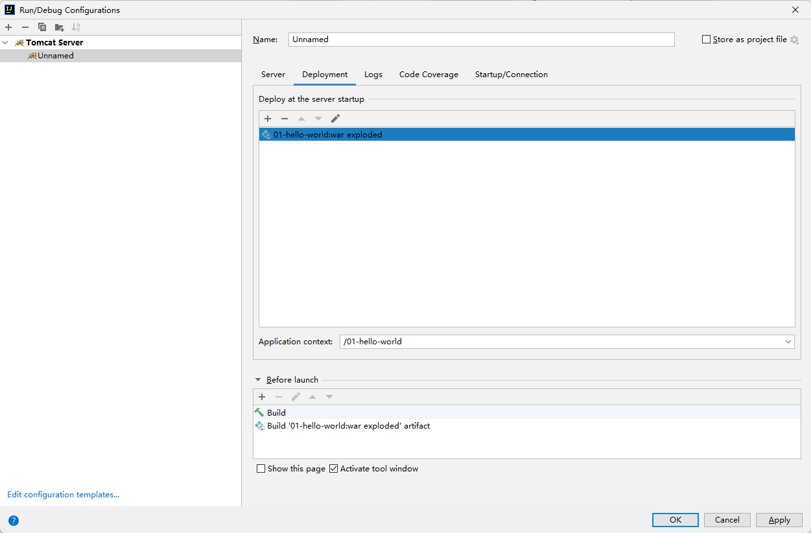

5. 测试访问

   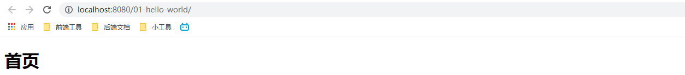

### 访问指定页面

1. 在页面中通过 thymeleaf 语法访问页面

   ```html
   <!-- 效果和 '/上下文路径/target' 一致，但由于上下文路径可能会改变，所以使用 th:href 即可 -->
   <a th:href="@{/target}">访问指定页面 target.html</a>
   ```

2. 配置控制器接口

   ```java
   @RequestMapping("/target")
   public String toTarget() {
       return "target";
   }
   ```

3. 别忘记在 `/WEB-INF/templates/` 下创建 `target.html`页面

   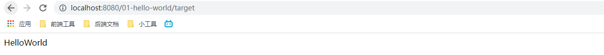

### 总结


## @RequestMapping 注解

**功能**：将指定的请求和控制器的方法关联起来，建立映射关系

**注解位置**：

- 类：访问该类中的所有接口都需要加上对应的路径
- 方法：访问该接口方法的请求路径

```java
@Controller
@RequestMapping("/user")
public class UserController {

    @RequestMapping("/home")
    public String toUserHome(){
        return "/home";
    }

}
```

> 需要访问 `/user/home` 才能访问到上述接口

**注解属性**：

1. value - **必须设置**

   作用：定义访问该接口的请求路径

   实例：属性值为字符串数组，支持不同请求地址访问一个接口

   ```java
   @RequestMapping(
       value = {"/home", "/test"},
   )
   ```
   
2. method

   作用：定义访问该接口的请求类型

   实例：支持不同请求类型访问一个接口; 如果不写默认是支持所有请求

   ```java
   @RequestMapping(
       value = {"/home", "/test"},
       method = {RequestMethod.POST, RequestMethod.GET}
   )
   ```

   注：对于 `method` 属性，SpringMVC 基于 **@RequestMapping** 提供了派生注解

   @GetMapping -> @RequestMapping(method=RequestMethod.GET)

   @PostMapping -> @RequestMapping(method=RequestMethod.POST)

   @PutMapping -> @RequestMapping(method=RequestMethod.PUT)

   @DelateMapping -> @RequestMapping(method=RequestMethod.DELETE)

3. params

   作用：字符串数组，定义访问该接口的请求参数，且必须都满足才可以

   实例：

   ```java
   @GetMapping(
       value = "/testRequestParamsAndHeader",
       params = {
           "username", // 必须携带 username 参数
           "!password", // 不能携带 password 参数
           "age=7", // age 请求参数值必须为 7
           "sex!=2" // sex 请求参数的值不能为 2
       }
   )
   public String testRequestParamsAndHeader() {
       return "/success";
   }
   ```

   

   ```html
   <!-- GET 请求，() 内表示请求参数 -->
   <a th:href="@{/user/testRequestParamsAndHeader(username='111',age=8,sex=2)}">测试 testRequestParamsAndHeader</a>
   ```

4. headers

   作用：字符串数组，定义访问该接口的请求头信息，且必须都满足才可以

   实例：写法和 `params` 属性值一样

   ```java
   @GetMapping(
       value = "/testRequestParamsAndHeader",
       headers = {
           "Host=localhost:8080" // Host 属性值必须为 localhost:8080
       }
   )
   ```

   注意：当 `headers` 属性不匹配时，响应状态码为 **404**

**Ant 风格**：@RequestMapping 注解中 `value` 属性值支持 Ant 风格的路径

? ：表示任意单个字符

\* ：表示任意零个或多个字符

**：表示任意的一层或多层目录

```java
@RequestMapping('/byq/**/txdy')
```

**占位符**：

作用：获取请求路径上的值

使用：配合 **@PathVariable** 一起使用

```java
@GetMapping("/testPathVariable/{id}/{username}")
public String testPathVariable(@PathVariable("id") Integer id, @PathVariable("username") String username) {
    System.out.println("id:" + id + ", username:" + username);
    return "/success";
}
```

其中 `{}` 表示占位符，可以通过 **@PathVariable** 注解并指定其 `value` 属性获取占位符上的数据

注：多在 Restful 风格的 api 接口中使用

## 获取请求参数

### 通过 servlet api 获取

```java
@GetMapping("/testServletApi")
public String testServletApi(HttpServletRequest request){
    String username = request.getParameter("username");
    String password = request.getParameter("password");
    System.out.println(username + "-" + password);
    return "success";
}
```

基本上不用这种方式

### 通过控制器方法的形参获取请求参数

在定义控制器时，可以**设置和请求参数同名的形参**，当游览器发送请求时，SpringMVC 会自动将请求参数映射到对应的形参

```java
@GetMapping("/testParam")
public String testParam(String username, String password, String[] hobby) {
    // 对于请求参数中的同名多个值，可以用 String(每个值之间用,分割) / String[] 接收
    System.out.println(username + "-" + password + "-" + Arrays.toString(hobby));
    return "success";
}
```

注意：若存在多个同名的请求参数，可以用 String(每个值之间用,分割) / String[] 接收

### @RequestParam

作用：将请求参数和控制器方法形参创建映射关系

注解属性：

1. `value`：指定该形参对应的请求参数

2. `required`：是否必须传输该参数，默认值为 **true**

   当设置为 true 时，表示该请求必须传输指定的请求参数，若没有传输，且没有设置 `defaultValue` 属性，就会报错;

   当设置为 false 时，若没有传输请求参数，该形参为 **null**(有 `defaultValue` 就是 `defaultValue `的值)

3. `defaultValue`：不管 `required ` 属性值为 true / false，当指定的请求参数没有传输或传输值为 ""，则使用该默认值为形参赋值

使用：

```java
@GetMapping("/testRequestParam")
public String testRequestParam(
    @RequestParam(value = "user_name", defaultValue = "byqtxdy") String username,
    @RequestParam(defaultValue = "123456") String password
) {
    System.out.println(username + "-" + password);
    return "success";
}
```

### @RequestHeader

作用：将请求头信息和控制器方法的形参创建映射关系

用法：和 **@RequestParam** 注解有一样的属性，用法同 **@RequestParam**

### @CookieValue

作用：将 cookie 数据和控制器方法的形参创建映射关系

用法：和 **@RequestParam** 注解有一样的属性，用法同 **@RequestParam**

### 通过 POJO 获取请求参数

可以在控制器形参的位置设置一个实体类类型的形参，若请求参数中存在与实体类属性同名的情况，那么该请求参数的值就会为该属性赋值

```html
<form th:action="@{/param/testPoJO}" method="post">
    用户名：<input type="text" name="username" /> <br/>
    密码：<input type="password" name="password" /> <br />
    性别： <input type="radio" name="sex" value="男">男 <input type="radio" name="sex" value="女"> 女 <br />
    年龄：<input type="text" name="age"/><br />
    邮箱：<input type="text" name="email"><br />
    <input type="submit" />
</form>
```

```java
public class User {
    private String username;

    private String password;

    private String sex;

    private Integer age;

    private String email;

    public String getUsername() {
        return username;
    }

    public void setUsername(String username) {
        this.username = username;
    }

    public String getPassword() {
        return password;
    }

    public void setPassword(String password) {
        this.password = password;
    }

    public String getSex() {
        return sex;
    }

    public void setSex(String sex) {
        this.sex = sex;
    }

    public Integer getAge() {
        return age;
    }

    public void setAge(Integer age) {
        this.age = age;
    }

    public String getEmail() {
        return email;
    }

    public void setEmail(String email) {
        this.email = email;
    }

    @Override
    public String toString() {
        return "User{" +
            "username='" + username + '\'' +
            ", password='" + password + '\'' +
            ", sex='" + sex + '\'' +
            ", age=" + age +
            ", email='" + email + '\'' +
            '}';
    }

}
```

```java
@PostMapping("/testPoJO")
public String testPojo(User user) {
    System.out.println(user);
    return "success";
}
```

### 解决获取请求参数乱码的问题

在 `web.xml`中注册 SpringMVC 提供的过滤器

```xml
<filter>
    <filter-name>characterEncodingFilter</filter-name>
    <filter-class>org.springframework.web.filter.CharacterEncodingFilter</filter-class>
    <!-- 设置(请求&响应)编码格式 -->
    <init-param>
        <param-name>encoding</param-name>
        <param-value>UTF-8</param-value>
    </init-param>
    <!-- 开启修改响应编码格式 -->
    <init-param>
        <param-name>forceResponseEncoding</param-name>
        <param-value>true</param-value>
    </init-param>
</filter>
<filter-mapping>
    <filter-name>characterEncodingFilter</filter-name>
    <url-pattern>/*</url-pattern>
</filter-mapping>
```

## 域对象共享数据

### 通过 servlet api 向 request 域对象共享数据

```java
@GetMapping("/servletApi")
public String byServletApi(HttpServletRequest request) {
    request.setAttribute("forServletApi", "byqtxdy");
    return "success";
}
```

### 使用 ModelAndView 向 request 域对象共享数据

```java
@GetMapping("/mav")
public ModelAndView byModelAndView() {
    ModelAndView mav = new ModelAndView();
    // 设置模型数据到 request 域中
    mav.addObject("forModelAndView", "hhhhh");
    // 设置视图名
    mav.setViewName("success");
    return mav;
}
```

> 视图名就是原返回字符串

### 使用 Model 向 request 域对象共享数据

```java
@GetMapping("/model")
public String byModel(Model model) {
    // 设置模型数据到 request 域中
    model.addAttribute("forModel", "tomoetyann");
    return "success";
}
```

### 使用 Map 向 request 域对象共享数据

```java
@GetMapping("/map")
public String byMap(Map<String, Object> dataMap) {
    dataMap.put("forMap", "通过 map 向 request 域中存储数据");
    return "success";
}
```

### 使用 ModelMap 向 request 域对象共享数据

```java
@GetMapping("/modelMap")
public String byModelMap(ModelMap modelMap) {
    modelMap.addAttribute("forModelMap", "testForModelMap");
    return "success";
}
```

### Map, Model, ModelMap 的关系

可以通过 `.getClass().getName()` 查看三者具体的参数类型，可以发现它们都是由一个东西实现的，也就是 **BindingAwareModelMap** 类型

```java
public interface Model{}
public class ModelMap extends LinkedHashMap<String, Object>{}
public class ExtendedModelMap extends ModelMap implements Model {}
public class BindingAwareModelMap extends ExtendedModelMap {}
```

> 注：更推荐使用 **ModelAndView**，因为其他几种在底层中最后也会通过 **ModelAndView** 实现

### 向 session 域中共享数据

> 虽然 SpringMVC 提供了相关注解可以使用，但对比原生 Servlet API 更方便

```java
@GetMapping("/servletApi")
public String byServletApi(HttpSession session) {
    session.setAttribute("testByServletApi", "session data");
    return "success";
}
```

### 向 application 域中共享数据

```java
public String byServletApi(HttpSession session) {
    // 通过 session 获取上下文对象
    ServletContext application = session.getServletContext();
    application.setAttribute("testByServletApi", "application data");
    return "success";
}
```

## SpringMVC 的视图

SpringMVC 提供了 View 接口，作用为渲染数据，将模型 Model 中的数据展示给用户

SpringMVC 提供的视图种类很多，默认有 **转发视图** 和 **重定向视图**

当工程中引入 `jstl` 时，**转发视图**会自动转换成 **JstlView**

若使用的视图技术为 `Thymeleaf` ，通过此前配置的 SpringMVC 视图解析器，可以得到 **ThymeleafView**

### ThymeleafView

当控制器接口所返回的视图名称没有任何**前缀**时，此时的视图名称会被 SpringMVC 配置文件中所配置的视图解析器解析，视图名称拼接视图前缀和视图后缀所得到的最终路径，最终通过转发的方式实现跳转

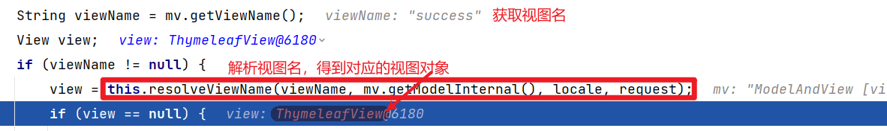

### 转发视图

SpringMVC 中默认的转发视图为 **InternalResourceView**

当控制器接口所返回的视图名称以 `forward:` 为前缀时，就会创建 InternalResourceView 视图，此时的视图名称不会被 SpringMVC 配置文件所配置的视图解析器解析，而是会将 `forward:` 去掉，剩余部分作为最终路径通过转发方式实现跳转

```java
@GetMapping("/forward")
public String testInternalResourceView() {
    return "forward:view/thymeleaf";
}
```

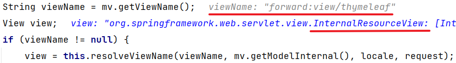

### 重定向视图

 SpringMVC 中默认的重定向视图为 **RedirectView**

当控制器接口所返回的视图名称以 `redirect:` 为前缀时，就会创建 RedirectView 视图，此时的视图名称不会被 SpringMVC 配置文件所配置的视图解析器解析，而是会将 `redirect:` 去掉，剩余部分作为最终路径通过**重定向实现跳转**

```java
@GetMapping("/redirect")
public String testRedirectView() {
    return "redirect:http://www.baidu.com";
}
```

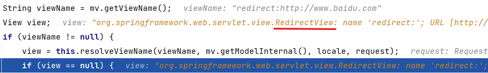

### 视图控制器 view-controller

当我们定义的控制器接口仅用来实现页面跳转，而不做任何逻辑处理时，可以将该接口在 SpringMVC 配置文件中用 `<view-controller>` 标签进行配置

```xml
<!-- 视图控制器 -->
<mvc:view-controller path="/" view-name="index"/>
```

> 注：当在 SpringMVC 中使用任何一个 `view-controller`时，其他控制器接口的请求映射将全部失效，此时需要在 SpringMVC 配置文件中添加额外的标签: `<mvc:annotation-driven />`

## Restful

### 简介

REST：表现层(视图+控制器)资源状态转移

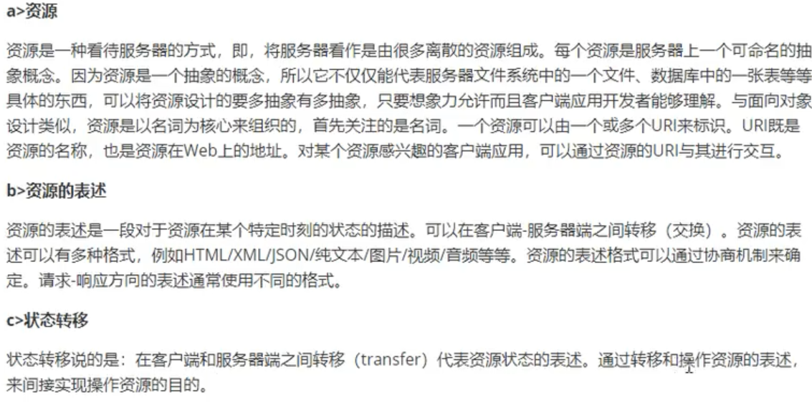

### 实现

基于 HTTP 协议实现的话，就要涉及到四个表示**操作方式**的动词：GET,POST,PUT,DELETE

分别对应四种基本操作：GET 用来获取资源，POST 用来新建资源，PUT 用来更新资源，DELETE 用来删除资源

REST 风格提倡 URL 地址使用统一的风格设计，从前到后各个单词使用斜杆分开，不使用传统的键值对方式来携带请求参数，而是将请求参数作为 URL 地址中的一部分，以保证整体风格的一致性

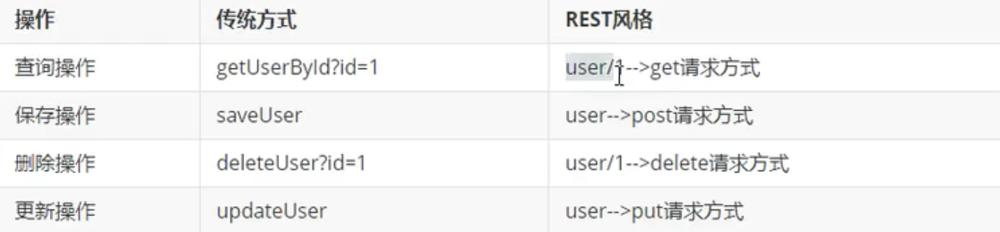

### HiddenHttpMethodFilter

对于原生的表单提交/点击超链接以及SpringMVC都是不支持直接发送 **PUT/ DELETE** 请求的

在 `web.xml`中添加以下配置

```xml
<!-- 配置 HiddenHttpMethodFilter 让 SpringMVC 支持 PUT & DELETE 请求 -->
<filter>
    <filter-name>httpMethodFilter</filter-name>
    <filter-class>org.springframework.web.filter.HiddenHttpMethodFilter</filter-class>
</filter>
<filter-mapping>
    <filter-name>httpMethodFilter</filter-name>
    <url-pattern>/*</url-pattern>
</filter-mapping>
```

要想发送 PUT / DELETE 请求，需要满足两个条件：

1. 表单提交方式为 **POST**

   ```html
   <form method="POST" th:action="${/user}">
   ```

2. 添加隐藏域表单项，其中 `name` 固定为 `_method`, `value` 为·**PUT/DELETE**

   ```html
   <input type="hidden" name="_method" value="PUT" />
   ```

注意：如果要同时使用 **CharacterEncodingFilter** 和 **HiddenHttpMethodFilter**，要让 **HiddenHttpMethodFilter** 的配置先于 **CharacterEncodingFilter**，这样才能保证都生效

### 案例

> 准备工作 - 实体类和DAO

```java
public class Employee {

    private Integer id;
    private String lastName;
    private String email;
    private Integer gender;

	// 构造器
    
    // get, set...
}
```

```java
@Repository
public class EmployeeDao {

    private static Map<Integer, Employee> employees = null;
    private static Integer initId = 1006;

    static {
        employees = new HashMap<Integer, Employee>();

        employees.put(1001, new Employee(1001, "E-AA", "aa@163.com", 1));
        employees.put(1002, new Employee(1002, "E-BB", "bb@163.com", 1));
        employees.put(1003, new Employee(1003, "E-CC", "cc@163.com", 0));
        employees.put(1004, new Employee(1004, "E-DD", "dd@163.com", 0));
        employees.put(1005, new Employee(1005, "E-EE", "ee@163.com", 1));
    }

    public void saveOrUpdate(Employee employee) {
        if(employee.getId() == null) {
            employee.setId(initId++);
        }
        employees.put(employee.getId(), employee);
    }

    public Collection<Employee> getAll() {
        return employees.values();
    }

    public Employee get(Integer id) {
        return employees.get(id);
    }

    public void delete(Integer id) {
        employees.remove(id);
    }

}
```

在 Controller 注入即可

> 实现查看所有员工信息

1. 编写接口

   ```java
   @GetMapping("/employees")
   public String getAllEmployee(Model model) {
       Collection<Employee> employees = employeeDao.getAll();
       model.addAttribute("employees", employees);
       return "employee_list";
   }
   ```

2. 创建对应的页面 `employee_list.html` 并通过 thymeleaf 渲染数据 

   ```html
   <table id="dataTable" border="1" cellpadding="0" cellspacing="0" style="text-align: center">
       <tr>
           <th>id</th>
           <th>lastName</th>
           <th>email</th>
           <th>gender</th>
           <th>options</th>
       </tr>
       <tr th:each="employee : ${employees}">
           <td th:text="${employee.id}"></td>
           <td th:text="${employee.lastName}"></td>
           <td th:text="${employee.email}"></td>
           <td th:text="${employee.gender}"></td>
           <td>
               <a @click.prevent="deleteEmployee" th:href="@{'/employee/' + ${employee.id}}">delete</a>
               <a href="">update</a>
           </td>
       </tr>
   </table>
   ```

> 实现删除功能

1. 编写 rest ful api 风格的接口

   ```java
   @DeleteMapping("/employee/{id}")
   public String deleteEmployee(@PathVariable Integer id) {
       employeeDao.delete(id);
       // 重定向到请求所有员工信息的接口
       return "redirect:/employees";
   }
   ```

2. 使用超链接控制表单来发送请求，所以先引入 `vue.js`

   ```html
   <form id="deleteForm" method="post">
       <input type="hidden" name="_method" value="delete" />
   </form>
   </body>
   ```

   

   ```javascript
   <script type="application/javascript" th:src="@{/static/vue.js}"></script>
   <script type="application/javascript">
       const vue = new Vue({
           el: "#dataTable",
           methods: {
               // 删除员工信息
               deleteEmployee(event) {
                   const deleteForm = document.getElementById("deleteForm")
                   // 添加 action
                   deleteForm.action = event.target.href
                   // 提交表单
                   deleteForm.submit()
               }
           }
       })
   </script>
   ```
   
3. 注意：对于静态资源，需要在 `spring-mvc.xml` 中添加额外配置，静态资源直接放在 `webapp/static` 文件夹下就好了

   ```xml
   <!-- 处理静态资源的请求 -->
   <mvc:default-servlet-handler />
   
   <!-- 开启 MVC 注解驱动 -->
   <mvc:annotation-driven />
   ```

    原理：发送请求时依然先由 **DispatcherServlet** 处理，当其不能处理时(没有对应的接口请求映射)，就会由 `default-servlet-handler` 配置的 Handler 调用默认的 Servlet 来处理 

> 实现添加功能

1. 添加视图控制器 `view-controller`

   ```xml
   <mvc:view-controller path="/toAdd" view-name="employee_add"/>
   ```

2. 创建 `employee_add.html`

   ```html
   <form th:action="@{/employee}" method="post">
       lastName: <input type="text" name="lastName"/> <br/>
       email: <input type="text" name="email"/> <br/>
       gender: <input type="radio" name="gender" value="1"> male
               <input type="radio" name="gender" value="0"> famale
               <br />
       <input type="submit" value="add">
   </form>
   ```

3. 编写对应的接口

   ```java
   @PostMapping("/employee")
   public String addEmployee(Employee employee) {
       employeeDao.saveOrUpdate(employee);
       return "redirect:/employees";
   }
   ```

4. 在 `employee_list.html`中添加超链接跳转

   ```html
   <th>options( <a th:href="@{/toAdd}">add</a> )</th>
   ```

> 实现修改功能

1. 回显数据 - 修改 `employee_list.html`超链接跳转

   ```html
   <a th:href="@{'/employee/' + ${employee.id}}">update</a>
   ```
   
2. 回显数据 - 编写获取一个员工详细信息接口

   ```java
   @GetMapping("/employee/{id}")
   public String getEmployeeDetail(@PathVariable Integer id, Model model) {
       Employee employee = employeeDao.get(id);
       model.addAttribute("employee", employee);
       return "employee_update";
   }
   ```

3. 编写 `employee_update.html`

   ```html
   <form th:action="@{/employee}" method="post">
       <input type="hidden" name="_method" value="put" />
       <input type="hidden" name="id" th:value="${employee.id}">
       lastName: <input type="text" name="lastName" th:value="${employee.lastName}"/> <br/>
       email: <input type="text" name="email" th:value="${employee.email}"/> <br/>
       gender: <input type="radio" name="gender" value="1" th:field="${employee.gender}"> male
               <input type="radio" name="gender" value="0" th:field="${employee.gender}"> famale
               <br />
       <input type="submit" value="update">
   </form>
   ```

4. 编写修改接口

   ```java
   @PutMapping("/employee")
   public String updateEmployee(Employee employee) {
       employeeDao.saveOrUpdate(employee);
       return "redirect:/employees";
   }
   ```

## HttpMessageConverter

 作用：报文信息转换器，将请求报文转换为 java 对象，或将 java 对象转换为响应报文

### @RequestBody

 作用：

获取请求体，一般用来处理发送请求时 `content-type` 不是默认的 `application/x-www-form-urlcoded` 编码的内容，例如 `application/json 或者是 application/xml 等`。

通过其可以将请求体中的**JSON字符串**绑定到相应的bean上，当然，也可以将其分别绑定到对应的字符串上。

实例：注意控制台输出

```html
<h4>测试 @RequestBody</h4>
<form th:action="@{/testRequestBody}" method="post">
    username: <input type="text" name="username"/>
    password: <input type="password" name="password" />
    <input type="submit" value="测试@RequestBody">
</form>
```

```java
@PostMapping("/testRequestBody")
public String testRequestBody(@RequestBody String userInfo) {
    System.out.println(userInfo);
    return "success";
}
```

### RequestEntity

作用：获取完整的请求报文(请求头 + 请求体)

实例：泛型代表 Body 的类型

```java
@PostMapping("/testRequestEntity")
public String testRequestEntity(RequestEntity<String> requestEntity) {
    System.out.println("请求头:" + requestEntity.getHeaders());
    System.out.println("请求体:" + requestEntity.getBody());
    return "success";
}
```

### @ResponseBody

作用：将控制器返回值直接作为响应体返回

实例：标注在控制器接口上

```java
@GetMapping("/testResponseBody")
@ResponseBody
public String testResponseBody() {
    return "byqtxdy";
}
```

### SpringMVC 处理 json

1. 导入 `jackson` 依赖

   ```xml
   <dependency>
       <groupId>com.fasterxml.jackson.core</groupId>
       <artifactId>jackson-databind</artifactId>
       <version>2.12.5</version>
   </dependency>
   ```

2. 在 SpringMVC 配置文件种开启注解驱动

   ```xml
   <!-- 开启 MVC 注解驱动 -->
   <mvc:annotation-driven />
   ```

3. 在控制器接口方法上标注 `@ResponseBody`注解即可

   ```java
   @GetMapping("/testResponseBodyJson")
   @ResponseBody
   public User testResponseBodyJson() {
       return new User(1001, "巴御前", "天下第一");
   }
   ```

4. 测试，访问游览器

   ```json
   {
       id: 1001,
       username: "巴御前",
       password: "天下第一"
   }
   ```

### SpringMVC 处理 ajax

1. 修改请求超链接

   ```html
   <div id="app">
       <h4>测试 SpringMVC 处理 Ajax</h4>
       <a th:href="@{/testAjax}" @click.prevent="testAjax">测试 SpringMVC 处理 Ajax</a>
   </div>
   ```
   
   
   
   ```javascript
   <script type="application/javascript" th:src="@{/static/js/vue.js}"></script>
   <script type="application/javascript" th:src="@{/static/js/axios.min.js}"></script>
   <script type="application/javascript">
       new Vue({
       el: "#app",
       methods: {
           testAjax(event) {
               axios({
                   method: 'post',
                   url: event.target.href,
                   data: {
                       username: 'admin',
                       password: '123456'
                   }
               }).then(function (response) {
                   alert(response.data)
               })
           }
       }
   })
   </script>
   ```
   
2. 编写对应的接口

   ```java
   @PostMapping("/testAjax")
   @ResponseBody
   public String testAjax(@RequestBody User user) {
       System.out.println(user);
       return "success";
   }
   ```

### @RestController

作用：标注在控制器类上，为该类中所有的接口添加 `@ResponseBody` 注解

```java
@RestController
public class TestController {
```

### ResponseEntity

作用：用于接口的返回值类型，该接口的返回值就是响应到游览器的响应报文

## 文件上传和下载

### 文件下载

> 使用 ResponseEntity 实现文件下载

```java
@GetMapping("/fileDown")
public ResponseEntity<byte[]> fileDown(HttpSession session) throws IOException {
    // 获取文件所在路径
    String filePath = session.getServletContext().getRealPath("/static/images/travel.png");
    // 创建输入流
    FileInputStream fis = new FileInputStream(filePath);
    // 创建字节数组，大小为文件大小
    byte[] bytes = new byte[fis.available()];
    // 将流数据读取到数组中
    fis.read(bytes);

    // 创建 HttpHeaders 设置响应头信息
    MultiValueMap<String, String> headers = new HttpHeaders();
    // 设置下载文件的方式和名字
    headers.add("Content-Disposition", "attachment;filename=travel.png");
    //创建 ResponseEntity 对象
    return new ResponseEntity<>(bytes, headers, HttpStatus.OK);
}
```

### 文件上传

1. 导入依赖

   ```xml
   <dependency>
       <groupId>commons-fileupload</groupId>
       <artifactId>commons-fileupload</artifactId>
       <version>1.3.1</version>
   </dependency>
   ```

2. 在 `spring-mvc.xml`配置文件上传解析器

   ```xml
   <!-- 配置文件上传解析器 -->
   <bean id="multipartResolver" class="org.springframework.web.multipart.commons.CommonsMultipartResolver"/>
   ```

3. 创建接口

   ```java
   @PostMapping("/fileUpload")
   @ResponseBody
   public String fileUpload(MultipartFile photo, HttpSession session) throws IOException {
       // 获取源文件名
       String originalFilename = photo.getOriginalFilename();
       // 获取保存图片文件夹路径
       String photoPath = session.getServletContext().getRealPath("photo");
       // 判断文件夹是否存在，如果不存在就创建对应的目录
       File file = new File(photoPath);
       if (!file.exists()) {
           file.mkdir();
       }
       // 获取文件后缀并使用 UUID 随机生成一个文件名保证文件名不重复
       String filename = UUID.randomUUID().toString().replaceAll("-","") + originalFilename.substring(originalFilename.lastIndexOf("."));
       // 设置图片路径
       String finalPath = photoPath + File.separator + filename;
       // 保存图片
       photo.transferTo(new File(finalPath));
       return "success";
   }
   ```

4. 添加 form 表单

   **method** 必须用 `post` && **enctype** 必须用 `multipart/form-data`

   ```html
   <form th:action="@{/fileUpload}" method="post" enctype="multipart/form-data">
       上传头像: <input type="file" name="photo" />
       <input type="submit" value="提交">
   </form>
   ```
   
5. 可以观察 `target/项目名` 下的文件夹

   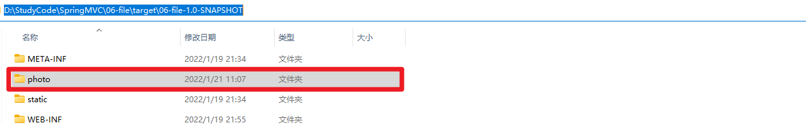

## 注解配置

## 扩展功能